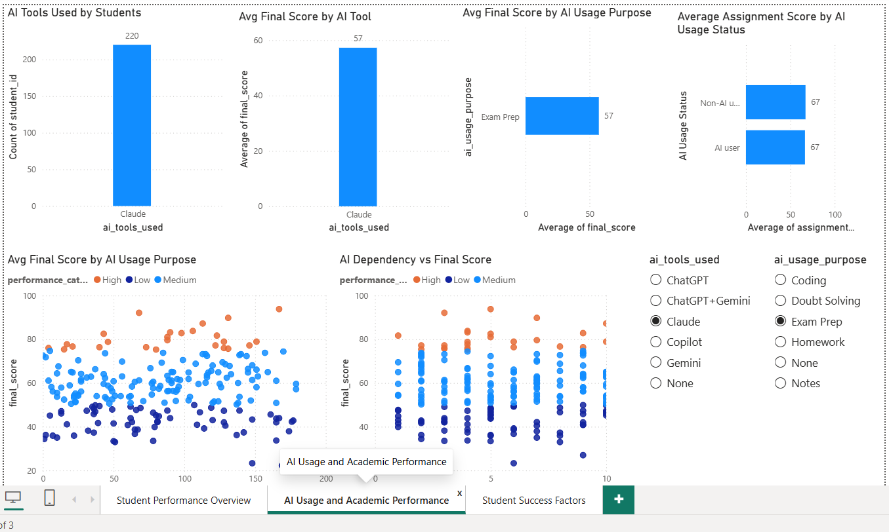
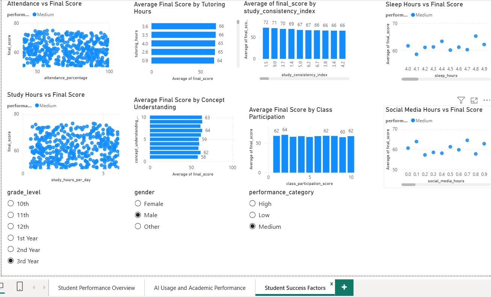

# AI Impact on Student Performance Dashboard

## 📌 Project Overview

This project analyzes how AI-based learning tools may influence student academic performance. The dataset includes student demographics, AI tool usage, study habits, attendance, assignment scores, exam scores, and final performance outcomes.

The goal of this project is to build a Power BI dashboard that helps identify patterns between AI usage and student performance.

---

## ❓ Business Problem

As AI tools such as ChatGPT, Copilot, Gemini, and Claude become more common in education, schools and educators need to understand how AI usage affects student learning outcomes.

This project aims to answer questions such as:

- Do students who use AI tools perform better academically?
- How does AI usage time relate to final scores?
- Does AI dependency affect student performance?
- What role do attendance, study hours, and tutoring play in student success?
- Which student groups show higher or lower performance?

---

## 🛠️ Tools Used

- **Excel** – Initial data review and cleaning
- **SQLite** – SQL querying and analysis
- **Power BI** – Dashboard creation and data visualization
- **GitHub** – Project documentation and portfolio hosting

---

## 📂 Dataset Source

Dataset: **AI Impact on Student Performance Dataset**  
Source: **Kaggle**  
Dataset file: `ai_impact_student_performance_dataset.csv`

The dataset includes student-level information such as:

- Student ID
- Age
- Gender
- Grade level
- Study hours per day
- AI usage status
- AI usage time
- AI tools used
- AI usage purpose
- AI dependency score
- Attendance percentage
- Assignment scores
- Last exam score
- Final score
- Pass/fail status
- Performance category

---

## 🔄 Steps Performed

### 1. Data Collection

Downloaded the dataset from Kaggle in CSV format.

### 2. Data Review

Reviewed the dataset structure, columns, data types, and missing values.

### 3. SQL Analysis

Imported the dataset into SQLite and wrote SQL queries to explore:

- Overall student performance
- AI users vs non-AI users
- Pass rate by AI usage
- Average final score by AI tool
- Average final score by AI usage purpose
- Attendance and study-hour patterns
- Student performance categories

### 4. Dashboard Development

Created a Power BI report with 3 pages:

1. **Overview Dashboard**
2. **AI Usage and Academic Performance**
3. **Student Success Factors**

---

## 📊 Dashboard Pages

### Page 1: Overview Dashboard

This page provides a high-level summary of student performance.

Key visuals include:

- Total students
- Average final score
- Average attendance
- Average study hours
- Pass rate
- Performance category distribution
- AI users vs non-AI users
- Average final score by grade level

### Page 2: AI Usage and Academic Performance

This page focuses on how AI-related behavior connects with student performance.

Key visuals include:

- Average AI usage time
- Average AI dependency score
- Average AI ethics score
- AI tools used by students
- Average final score by AI tool
- Average final score by AI usage purpose
- AI usage time vs final score
- AI dependency vs final score

### Page 3: Student Success Factors

This page explores non-AI factors that may influence student performance.

Key visuals include:

- Attendance vs final score
- Study hours vs final score
- Sleep hours vs final score
- Social media hours vs final score
- Concept understanding vs final score
- Class participation vs final score
- Study consistency vs final score

---

## 🔍 Key Insights

- The dataset contains student-level academic, behavioral, and AI usage information.
- AI users and non-AI users showed very similar average final scores in the dashboard.
- AI usage alone does not appear to be the only major factor affecting academic performance.
- Attendance, study habits, concept understanding, and class participation appear to be important factors in student success.
- High AI dependency should be monitored to ensure students are still developing independent understanding.
- Student performance appears to be influenced by a combination of academic habits, AI usage, and engagement factors.

---

## 🖼️ Dashboard Screenshots

### Overview Dashboard


### AI Usage and Academic Performance



### Student Success Factors



---

## ✅ Final Recommendations

- Encourage responsible and ethical use of AI learning tools.
- Use AI as a learning assistant rather than a replacement for independent study.
- Monitor students with high AI dependency scores.
- Support students with low attendance, low study consistency, or low concept understanding.
- Use dashboards like this to help educators identify student performance trends and make data-driven decisions.

---

## 📁 Project Structure

```text
ai-impact-on-student-performance-dashboard/
│
├── data/
│   └── ai_impact_student_performance_dataset.csv
│
├── sql/
│   └── analysis_queries.sql
│
├── dashboard/
│   └── ai_student_performance_dashboard.pbix
│
├── images/
│   ├── overview_dashboard.png
│   ├── ai_usage_analysis.png
│   └── student_success_factors.png
│
└── README.md
